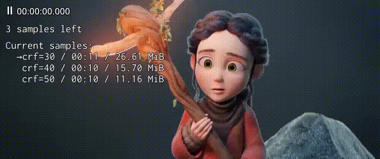

**txs** (**t**est **x**264 **s**ettings) is a command line tool that can
generate different combinations of x264 settings and make short test encodings
with [ffmpeg](https://ffmpeg.org). It also comes with a Lua script for
[mpv](https://mpv.io) that allows you to visually compare the test encodes and
find the best one based on quality, estimated file size and estimated encoding
time. It looks like this:

This is the output of `txs tutorial`:

    $ txs -s source.mkv -r 25:00 10 -x crf=19:me=umh samples \
      -xs aq-strength=0.5/1.0:aq-mode=2/3:no-deblock

The above command creates all possible combinations of the values for
`aq-strength`, `aq-mode` and `no-deblock` in the directory
`samples.source@25:00-10.aq-strength:aq-mode:no-deblock`. These files are all 10
seconds long, start at 20 minutes in `source.mkv` and use the settings given to
the `-x` option:

    source.sample@25:00-10.crf=19:me=umh:aq-strength=0.5:aq-mode=2.mkv
    source.sample@25:00-10.crf=19:me=umh:aq-strength=0.5:aq-mode=2:no-deblock.mkv
    source.sample@25:00-10.crf=19:me=umh:aq-strength=0.5:aq-mode=3.mkv
    source.sample@25:00-10.crf=19:me=umh:aq-strength=0.5:aq-mode=3:no-deblock.mkv
    source.sample@25:00-10.crf=19:me=umh:aq-strength=1.0:aq-mode=2.mkv
    source.sample@25:00-10.crf=19:me=umh:aq-strength=1.0:aq-mode=2:no-deblock.mkv
    source.sample@25:00-10.crf=19:me=umh:aq-strength=1.0:aq-mode=3.mkv
    source.sample@25:00-10.crf=19:me=umh:aq-strength=1.0:aq-mode=3:no-deblock.mkv

    $ txs -s source.mkv -r 25:00 10 -x crf=19:me=umh samples \
      -xs crf=20/30:aq-strength=0.5/1.0 crf=25/35:aq-mode=2/3

Notice how `-xs` was given multiple sets of settings. Settings from one set
aren't combined with settings from other sets, so we end up with these samples:

    source.sample@25:00-10.me=umh:crf=20:aq-strength=0.5.mkv
    source.sample@25:00-10.me=umh:crf=20:aq-strength=1.0.mkv
    source.sample@25:00-10.me=umh:crf=30:aq-strength=0.5.mkv
    source.sample@25:00-10.me=umh:crf=30:aq-strength=1.0.mkv
    source.sample@25:00-10.me=umh:crf=25:aq-mode=2.mkv
    source.sample@25:00-10.me=umh:crf=25:aq-mode=3.mkv
    source.sample@25:00-10.me=umh:crf=35:aq-mode=2.mkv
    source.sample@25:00-10.me=umh:crf=35:aq-mode=3.mkv

To compare encodes, use the `compare` subcommand:

    $ txs -s source.mkv compare ./samples:orig@25:00-1.aq-strength:aq-mode

This opens mpv in fullscreen mode with a playlist of samples in
`./samples:orig@25:00-1.aq-strength:aq-mode`. You can adjust the playlist size
with the `-p` option. Switch between samples with `j` and `k`. If you seek to a
different time, it should be preserved during switching. (You can even switch
while playing a sample.) You can also switch to the original source with `o`,
although seek time preservation doesn't work very well in that case.

If one sample is the best in the current playlist, press `b` to unload all other
samples and fill the playlist again. The best sample is kept in the playlist.

If one sample is the worst in the current playlist, press `w` to unload that
sample. No more samples will be added to the playlist unless there is only one
sample left. `Shift+w` does the same thing as `w`, but it also removes the
sample from the file system.

If all samples in the current playlist are equal, press `e` to stash them. The
playlist is filled with new samples. Once you have seen all samples at least
once, previously stashed samples are loaded again.

This process ends when there is only one sample left.

You can show/hide the playlist with `.

Run `txs compare -h` for a list of configuration options and key bindings.

    $ txs -s source.mkv -r 2:00 90 -x crf=19:me=umh:trellis=2 bframes -b 10

This command will make a test encoding and show you the "consecutive B-frames"
line from ffmpeg's output in a more readable way.

For the test encoding, the given settings are used but optimized for speed. For
example, `crf` will be forced to `51` because it doesn't affect B-frames
percentages and it's faster.

<!-- ### Installation -->

<!-- Install [pipx](https://pipxproject.github.io/pipx/) with your distro's package -->
<!-- manager or with pip: -->

<!--     $ python3 -m pip install --user pipx -->

<!-- Then install txs with pipx: -->

<!--     $ pipx install --spec git+https://github.com/plotski/txs.git txs -->
